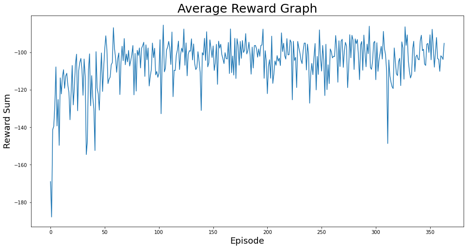
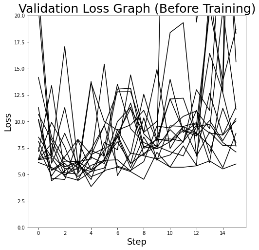
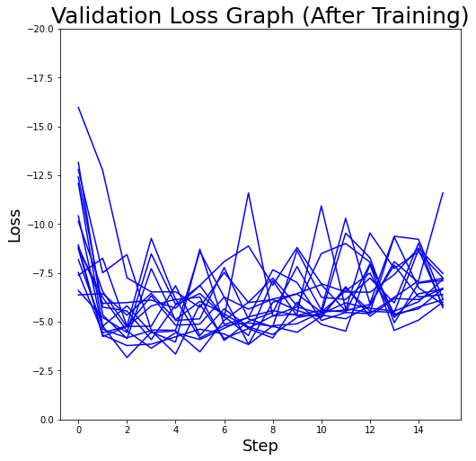
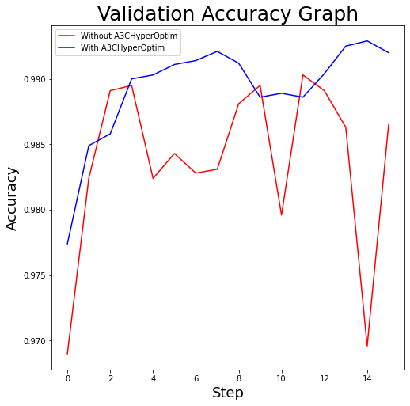

# A3CHyperOptim

`main.py` trains the given environment using A3C algorithm.

`abstractmodel.py` defines the template for ML models.

The models using abstractmodel contains hyperparameter specification, the ML model itself, and training, validation logic.

You can find an example in `models/mnist_cnn.py`

`environment.py` defines a gym environment that training a abstractmodel. It contains state, action, reward logic.

`hyperparameter.py` defines the general hyperparameter space.

### First Experiment

### Experiment Result

#### Average reward of workers during epochs

Experiment Condition : 4 workers, 16 steps per episode, 1 dropping, gamma 0.9, update period 4

See [settings.py](settings.py)

#### Validation Loss Comparison

Validation loss before training.

Validation loss after 364 episodes.

#### Validation Accuracy Comparison

Without A3CHyperOptim : Using Adam optimizer with lr=0.001, weight_decay=0

With A3CHyperOptim : Using Adam with A3CHyperOptim with dynamic lr and weight_decay ((0, 0.002), (1e-6, 1e-4))

