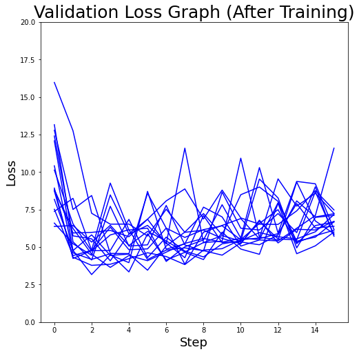

# A3CHyperOptim

`main.py` trains the given environment using A3C algorithm.

`abstractmodel.py` defines the template for ML models.

The models using abstractmodel contains hyperparameter specification, the ML model itself, and training, validation logic.

You can find an example in `models/mnist_cnn.py`

`environment.py` defines a gym environment that training a abstractmodel. It contains state, action, reward logic.

`hyperparameter.py` defines the general hyperparameter space.

### First Experiment

### Experiment Result

